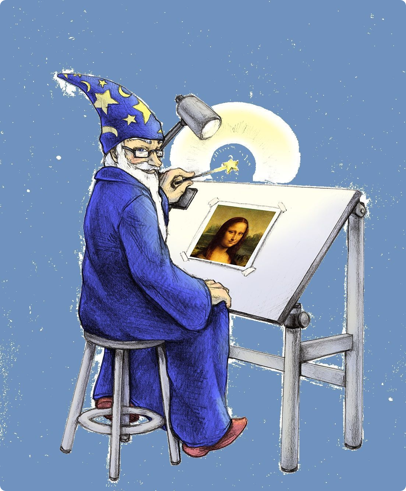
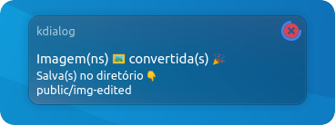

Criando um wallpaper simples com efeito blur, utilizando imagemagick junto com node.js

 
 

 

<h4 align="center"><b>Imagem Original</b></h4>

<h4 align="center"><b>Imagem Convertida</b></h4>

 
 

> ⚠ **Atenção**: Antes de prosseguir com o passo a passo descrito abaixo, você precisa ter instalado em sua máquina o [Node Js](https://nodejs.org/en/download/) o [ImageMagick](https://imagemagick.org/script/download.php) e caso queira, o gerenciador de pacote [Yarn](https://yarnpkg.com/getting-started/install).
 
Se não for o seu caso 😎 então você já pode prosseguir 👍

---

 

## **Clonando o repositório**
Antes você deve clonar este repositório. E para isso existe diversas formas de se fazer.

1. Clonando via `https`:
	> Execute no terminal
	~~~bash
	git clone https://github.com/AntonioNarcilio/imagemagick-effect-blur.git
	~~~

2. Clonando via `ssh` *preferencialmente**:
	> Execute no terminal
	~~~bash
	git clone git@github.com:AntonioNarcilio/imagemagick-effect-blur.git
	~~~

3. Baixando arquivo `.zip` 
	> Basta clicar la no inicio da pagina no botão <kbd>code</kbd> e depois em <kbd>Download ZIP</kbd>
	>ou basta clicar [Aqui](https://github.com/AntonioNarcilio/imagemagick-effect-blur/archive/main.zip)

	>Ai é so descompactar o arquivo `.zip` que você verá uma pasta com o nome do repositório `imagemagick-effect-blur`.

 

---

## **Criando o wallpaper**

Dentro do diretório/pasta criado ao clona/baixar. Mova a(s) imagem(ns) que deseja criar o(s) *"wallpaper(s)"* para o diretório <kbd>public</kbd> / <kbd>img-original</kbd>, e então siga um dos passos a passo descrito abaixo 👇.

 

#### **1️⃣ Executando aplicação via script**

Na pasta raiz da aplicação encontra-se um arquivo chamado `RUN_App.sh`, antes de executar o script dê permissão de execução para o mesmo, então abra o terminal no diretório onde se encontra o arquivo e execute o comando.

~~~bash
chmod +x RUN_App.sh
~~~

E então execute-o com duplo clique o script `RUN_App` 

 

---

 

#### **2️⃣ Executando aplicação via terminal >_**

Se preferir abra o terminal no diretório raiz da aplicação e execute o comando

~~~bash
npm run start
~~~
> ou

~~~bash
yarn run start
~~~

 

---

 

Pronto se tudo ocorrer conforme o 🙌 esperado 🎊 a imagem editada será salva no diretório 🗂 <kbd>public</kbd> / <kbd>img-edited</kbd> 

 

>Se assim como eu, você é utilitário do KDE com interface `plasma` então ao executar o script `RUN_App.sh` aparecerá uma simples mensagem popup informando que a(s) imagem(ns) foi/foram editada(s) ...

 
 

Created with ❤ by **Antônio Narcilio**