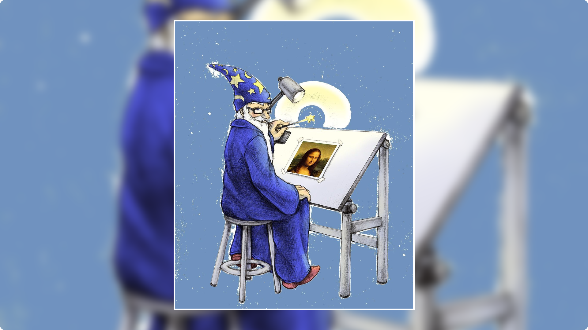

### Criando um wallpaper simples com efeito blur utilizando imagemagick junto com node.js

 

<h4 align="center"><b>Imagem Original</b></h4>

<h4 align="center"><b>Imagem Convertida</b></h4>

 
 

Mova a(s) imagem(ns) que deseja criar o(s) *"wallpaper(s)"* para o diretório <kbd>public</kbd> / <kbd>img-original</kbd>, e então siga um dos passos a passo descrito abaixo 👇.

 

#### **1️⃣ Executando aplicação via script**

Na pasta raiz da aplicação encontra-se um arquivo chamado `RUN_App.sh`, antes de executar o script dê permissão de execução para o mesmo, então abra o terminal no diretório onde se encontra o arquivo e execute o comando.

~~~bash
chmod +x RUN_App.sh
~~~

E então execute-o com duplo clique o script `RUN_App` 

 

---

 

#### **2️⃣ Executando aplicação via terminal >_**

Se preferir abra o terminal no diretório raiz da aplicação e execute o comando

~~~bash
npm run start
~~~
> ou

~~~bash
yarn run start
~~~

 

---

 

Pronto se tudo ocorrer conforme o 🙌 esperado 🎊 a imagem editada será salva no diretório 🗂 <kbd>public</kbd> / <kbd>img-edited</kbd> 